# 🎨 Visual Architecture Guide

## System Architecture Overview

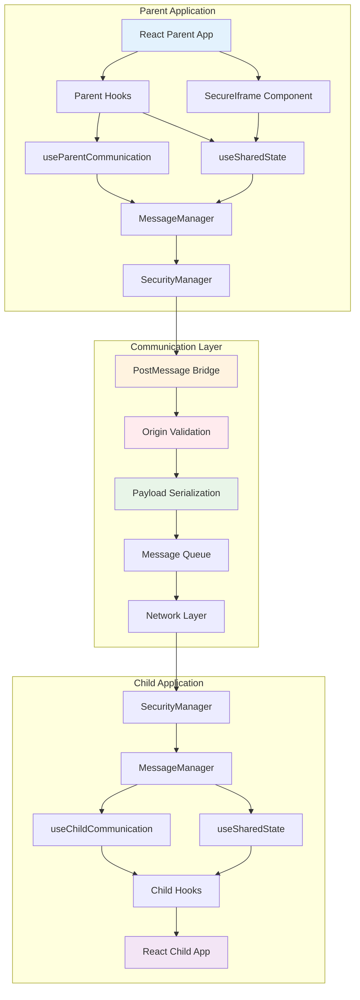

## Communication Flow Diagrams

### 1. Initial Handshake Flow

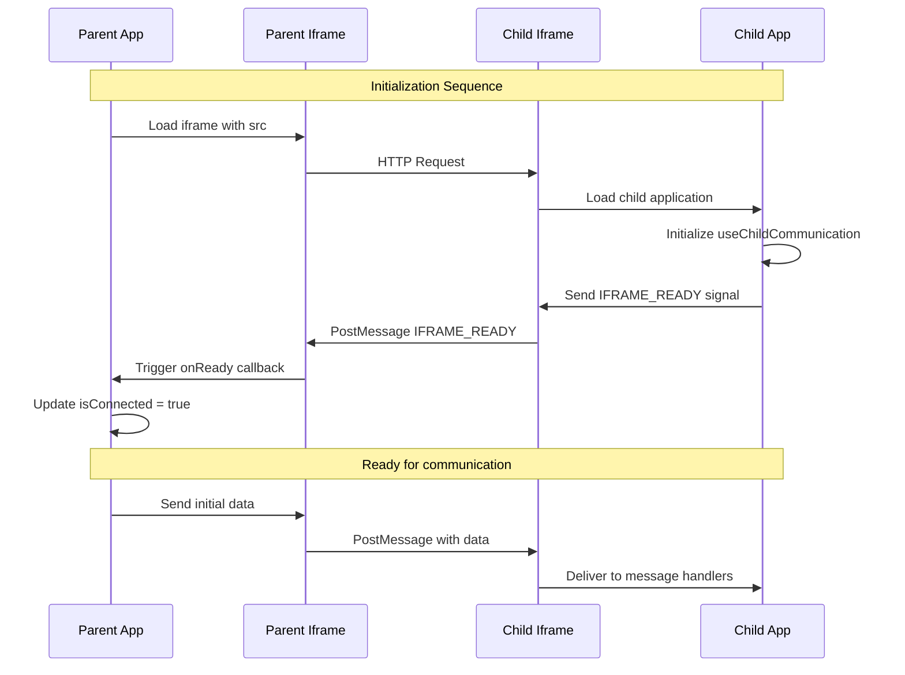

### 2. Message Exchange Flow

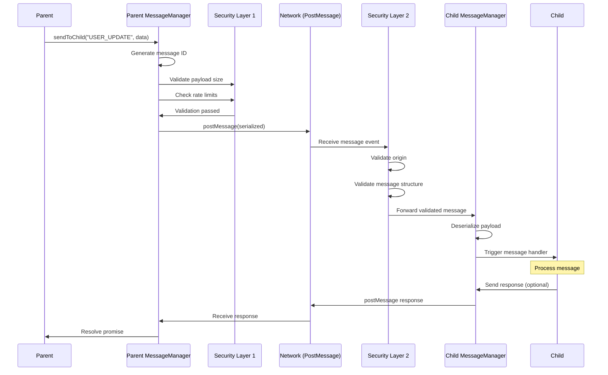

### 3. Shared State Synchronization

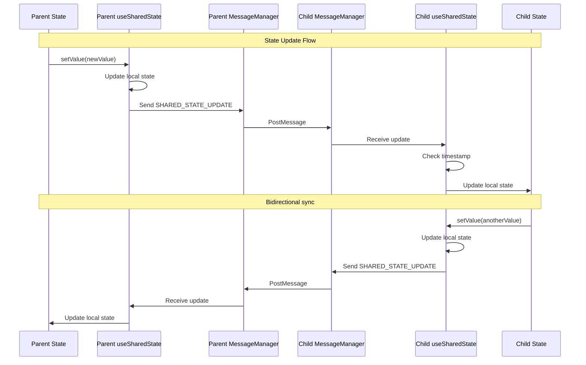

### 4. Error Handling Flow

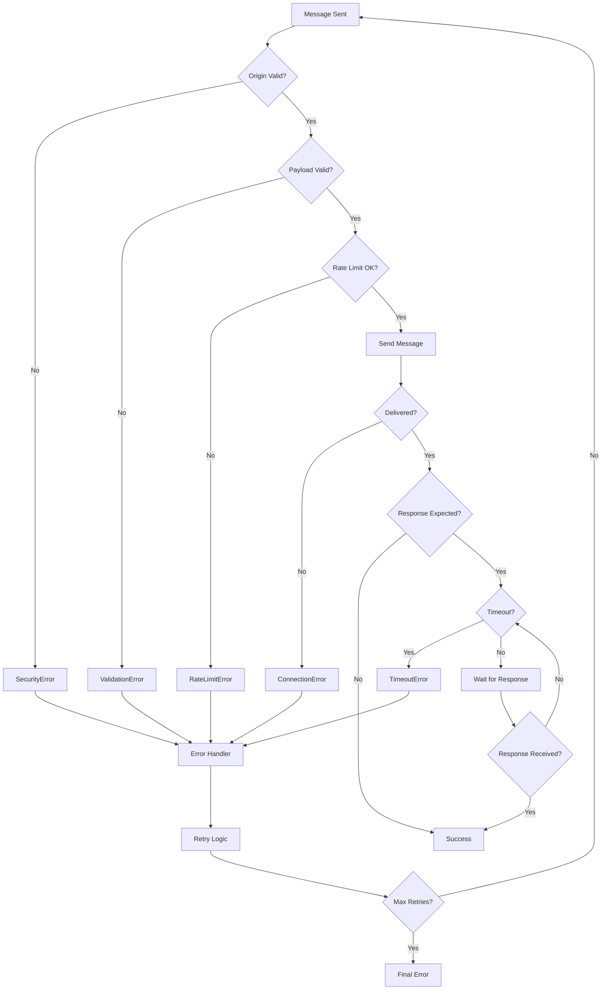

## Component Architecture

### 1. useParentCommunication Hook Architecture

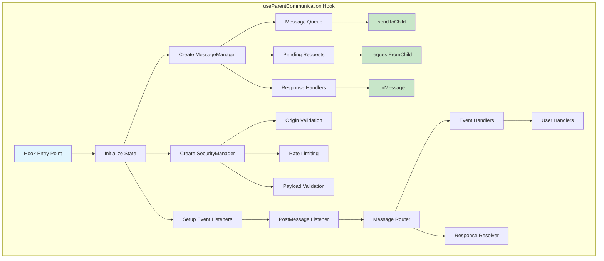

### 2. useSharedState Hook Architecture

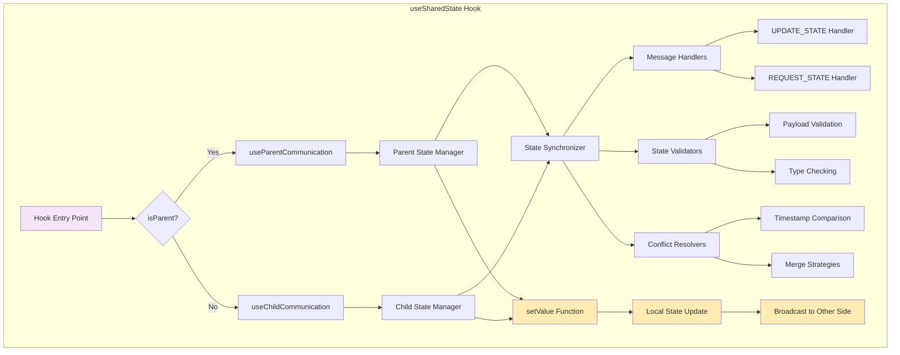

### 3. SecureIframe Component Architecture

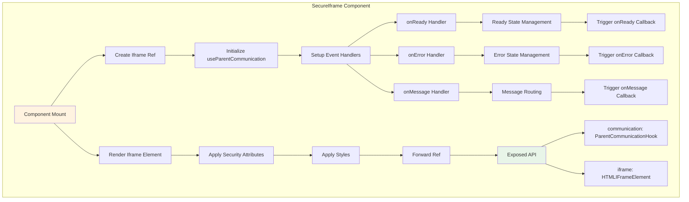

## Data Flow Patterns

### 1. One-Way Data Flow (Parent → Child)

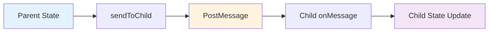

### 2. Request-Response Pattern

```mermaid
graph LR
    A[Parent Request] --> B[requestFromChild]
    B --> C[PostMessage Request]
    C --> D[Child onMessage]
    D --> E[Child Processing]
    E --> F[respondToParent]
    F --> G[PostMessage Response]
    G --> H[Parent Promise Resolve]
    
    style A fill:#e3f2fd
    style H fill:#e3f2fd
    style E fill:#f3e5f5
    style C fill:#fff3e0
    style G fill:#fff3e0
```

### 3. Bidirectional State Sync

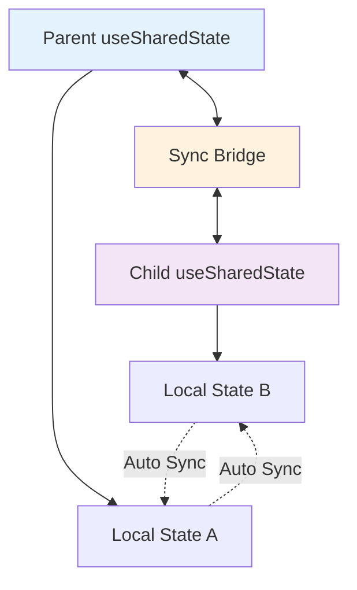

## Security Architecture

### 1. Security Layers

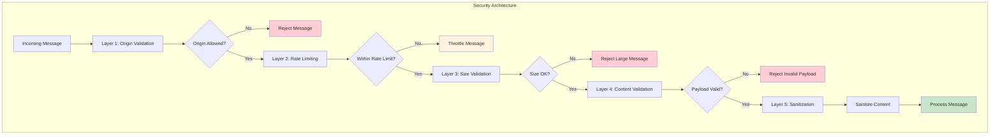

### 2. Origin Validation Flow

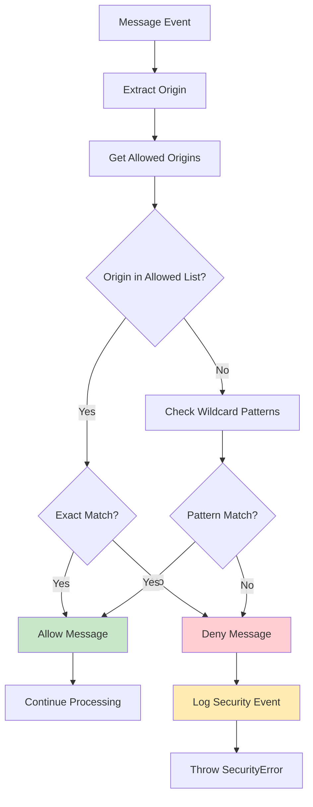

## Performance Optimization Flow

### 1. Message Batching

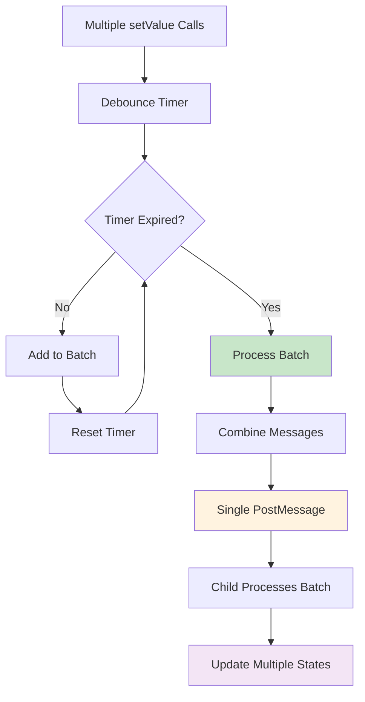

### 2. Memory Management

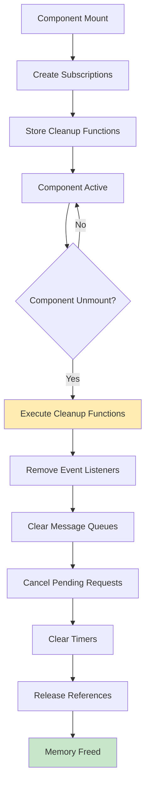

## Real-World Implementation Examples

### 1. E-commerce Checkout Flow

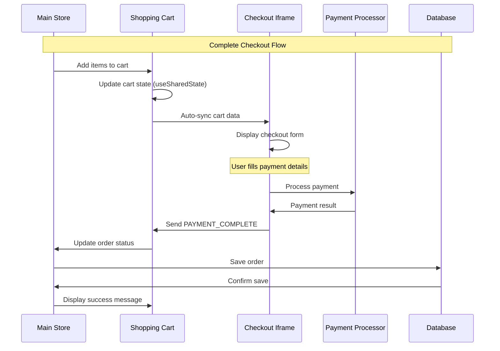

### 2. Multi-Widget Dashboard

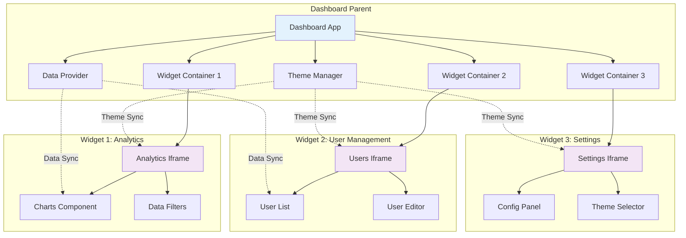

### 3. Social Login Widget

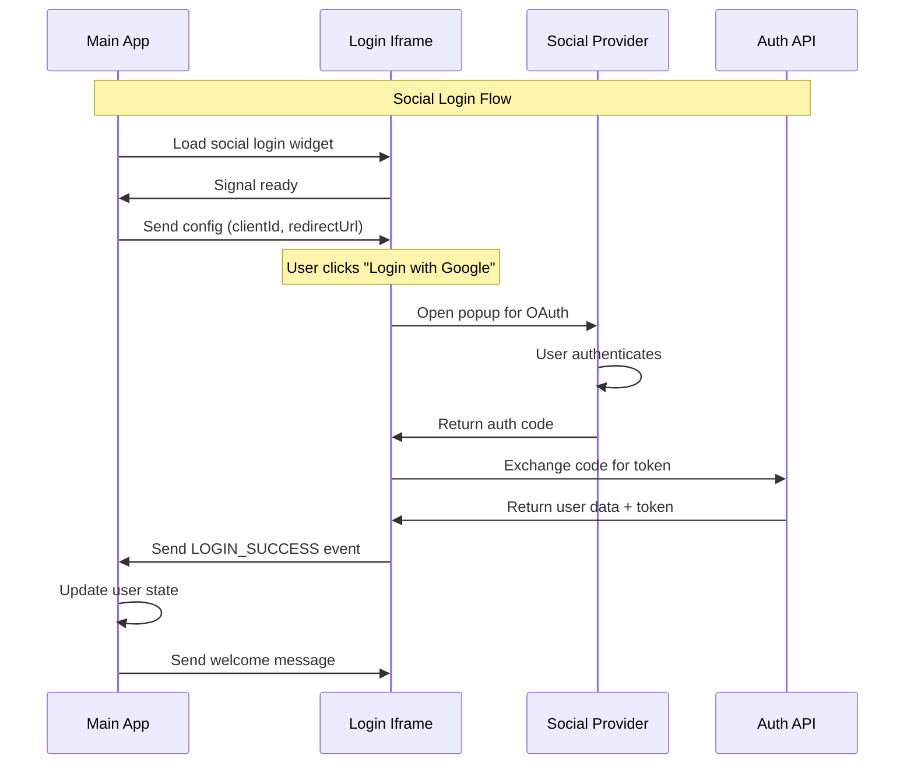

## Performance Monitoring Dashboard

### 1. Metrics Collection Flow

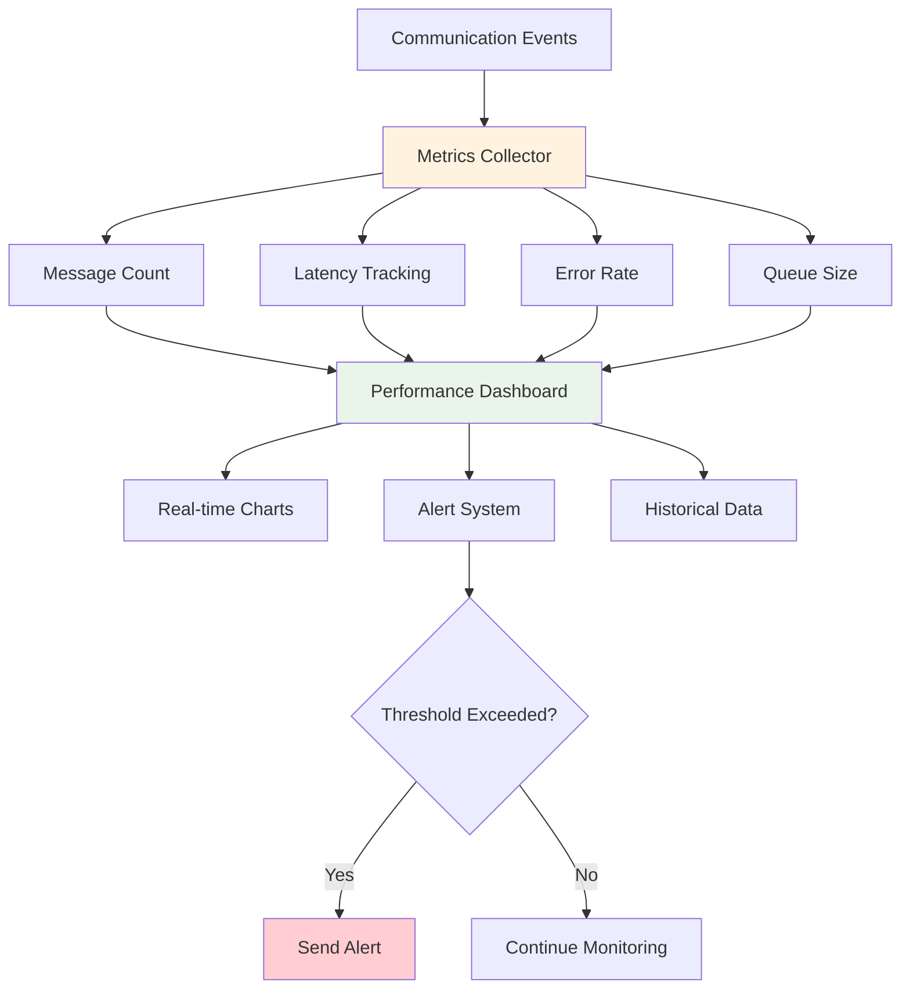

### 2. Memory Usage Tracking

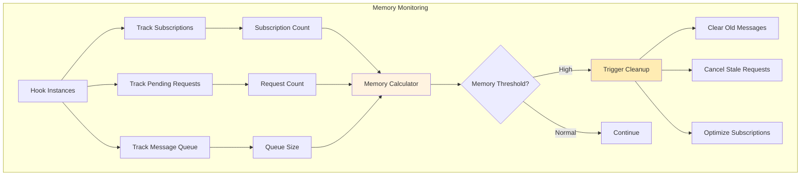

## Error Recovery Patterns

### 1. Connection Recovery Flow

```mermaid
stateDiagram-v2
    [*] --> Disconnected
    Disconnected --> Connecting: startConnection()
    Connecting --> Connected: connectionSuccess()
    Connecting --> Error: connectionFailed()
    Connected --> Error: communicationError()
    Error --> Reconnecting: autoRetry()
    Reconnecting --> Connected: retrySuccess()
    Reconnecting --> Failed: maxRetriesExceeded()
    Failed --> Disconnected: resetConnection()
    Connected --> Disconnected: manualDisconnect()
```

### 2. Message Retry Logic

```mermaid
graph TD
    A[Send Message] --> B{Delivery Successful?}
    B -->|Yes| C[Complete]
    B -->|No| D[Increment Retry Count]
    D --> E{Max Retries Reached?}
    E -->|No| F[Wait Retry Delay]
    F --> G[Exponential Backoff]
    G --> A
    E -->|Yes| H[Final Failure]
    H --> I[Trigger Error Handler]
    
    style C fill:#c8e6c9
    style H fill:#ffcdd2
    style G fill:#fff3e0
```

## Development Workflow

### 1. Testing Strategy Flow

```mermaid
graph TB
    subgraph "Testing Pyramid"
        A[Unit Tests] --> B[Integration Tests]
        B --> C[E2E Tests]
        C --> D[Performance Tests]
    end
    
    subgraph "Test Environment"
        E[Mock Parent] --> F[Test Communication]
        F --> G[Mock Child]
        
        H[Real Parent] --> I[Test Integration]
        I --> J[Real Child]
    end
    
    subgraph "CI/CD Pipeline"
        K[Code Commit] --> L[Run Unit Tests]
        L --> M[Run Integration Tests]
        M --> N[Run E2E Tests]
        N --> O[Performance Benchmarks]
        O --> P{All Tests Pass?}
        P -->|Yes| Q[Deploy]
        P -->|No| R[Block Deployment]
    end
    
    style Q fill:#c8e6c9
    style R fill:#ffcdd2
```

### 2. Debugging Workflow

```mermaid
graph TD
    A[Issue Reported] --> B[Enable Debug Mode]
    B --> C[Collect Logs]
    C --> D[Analyze Communication Flow]
    D --> E{Message Sent?}
    E -->|No| F[Check Parent Hook]
    E -->|Yes| G{Message Received?}
    G -->|No| H[Check Network/Origin]
    G -->|Yes| I{Handler Called?}
    I -->|No| J[Check Message Type]
    I -->|Yes| K{Expected Behavior?}
    K -->|No| L[Debug Handler Logic]
    K -->|Yes| M[Issue Resolved]
    
    F --> N[Fix Parent Code]
    H --> O[Fix Configuration]
    J --> P[Fix Message Routing]
    L --> Q[Fix Business Logic]
    
    N --> M
    O --> M
    P --> M
    Q --> M
    
    style M fill:#c8e6c9
```

## Deployment Architecture

### 1. Multi-Environment Setup

```mermaid
graph TB
    subgraph "Development"
        A[Local Parent] --> B[Local Child]
        A --> C[Mock Services]
    end
    
    subgraph "Staging"
        D[Staging Parent] --> E[Staging Child]
        D --> F[Staging APIs]
    end
    
    subgraph "Production"
        G[Prod Parent] --> H[Prod Child]
        G --> I[Prod APIs]
        H --> J[CDN Resources]
    end
    
    subgraph "Configuration"
        K[Dev Config] --> A
        L[Staging Config] --> D
        M[Prod Config] --> G
    end
    
    style K fill:#e3f2fd
    style L fill:#fff3e0
    style M fill:#ffcdd2
```

### 2. CDN and Caching Strategy

```mermaid
graph TB
    subgraph "Parent Domain"
        A[Parent App] --> B[Library Bundle]
        B --> C[Component Cache]
    end
    
    subgraph "Child Domain"
        D[Child App] --> E[Library Bundle]
        E --> F[Component Cache]
    end
    
    subgraph "CDN Layer"
        G[Global CDN] --> H[Regional CDN]
        H --> I[Edge Cache]
    end
    
    B --> G
    E --> G
    I --> J[Browser Cache]
    
    style G fill:#e8f5e8
    style J fill:#fff3e0
```

## Monitoring and Observability

### 1. Real-time Monitoring Dashboard

```mermaid
graph TB
    subgraph "Data Collection"
        A[Communication Events] --> B[Metrics Aggregator]
        C[Error Events] --> B
        D[Performance Data] --> B
    end
    
    subgraph "Processing"
        B --> E[Time Series DB]
        B --> F[Error Tracking]
        B --> G[Log Aggregation]
    end
    
    subgraph "Visualization"
        E --> H[Grafana Dashboard]
        F --> I[Error Dashboard]
        G --> J[Log Viewer]
    end
    
    subgraph "Alerting"
        H --> K[Alert Manager]
        I --> K
        K --> L[Slack Notifications]
        K --> M[Email Alerts]
        K --> N[PagerDuty]
    end
    
    style B fill:#fff3e0
    style K fill:#ffecb3
```

### 2. Performance Tracking

```mermaid
graph LR
    A[Message Sent] --> B[Start Timer]
    B --> C[Message Processing]
    C --> D[Response Received]
    D --> E[End Timer]
    E --> F[Calculate Latency]
    F --> G[Update Metrics]
    G --> H[Performance Dashboard]
    
    style F fill:#e8f5e8
    style H fill:#e3f2fd
```

This comprehensive visual guide covers all aspects of the iframe bridge library architecture, from high-level system design to detailed implementation flows, error handling, testing strategies, and deployment considerations! 📊🎨