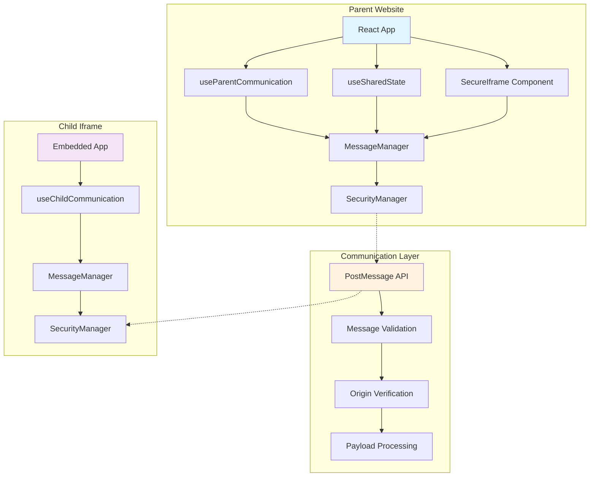
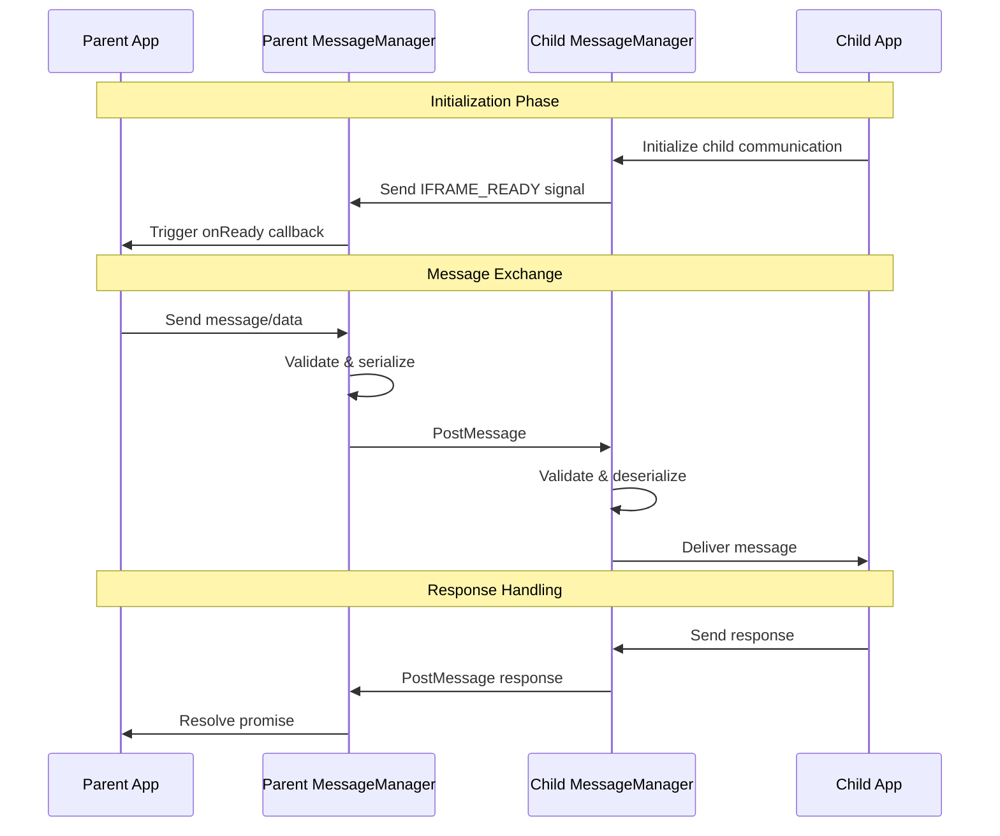
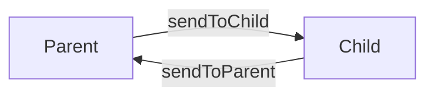
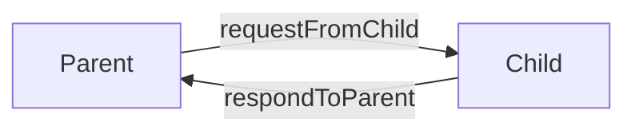
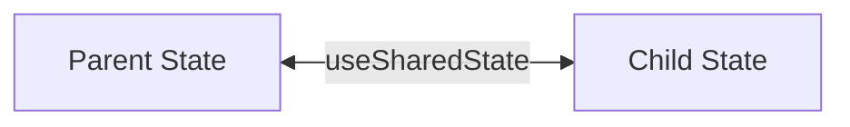
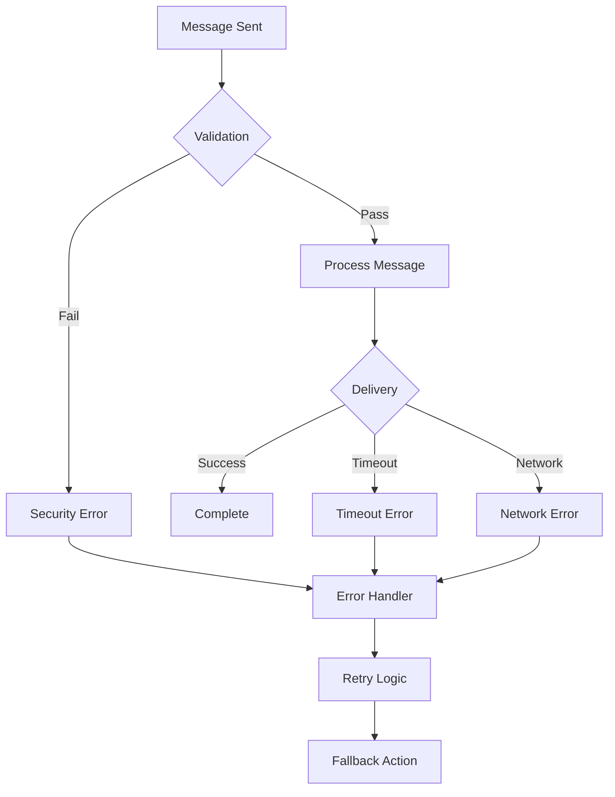

# 🌉 Iframe Bridge Library - Complete Documentation

## 📋 Table of Contents

1. [Overview](#overview)
2. [Architecture](#architecture)
3. [Installation & Setup](#installation--setup)
4. [Core Concepts](#core-concepts)
5. [API Reference](#api-reference)
6. [Hook Documentation](#hook-documentation)
7. [Component Documentation](#component-documentation)
8. [Security Guide](#security-guide)
9. [Performance Guide](#performance-guide)
10. [Examples & Tutorials](#examples--tutorials)
11. [Troubleshooting](#troubleshooting)
12. [Migration Guide](#migration-guide)

---

## 📖 Overview

### What is Iframe Bridge Library?

The Iframe Bridge Library is a TypeScript-first React library that enables secure, real-time communication between parent websites and embedded iframes. It solves the common problem of iframe isolation by providing a simple, type-safe API for bidirectional communication.

### Key Features

- 🔒 **Secure by Default**: Origin validation, message size limits, input sanitization
- ⚡ **Real-time Communication**: Instant bidirectional messaging
- 🎯 **Type-Safe**: Full TypeScript support with IntelliSense
- 🔄 **State Synchronization**: Automatic state syncing between parent and child
- 🛡️ **Error Handling**: Graceful fallbacks and comprehensive error reporting
- 📱 **Framework Agnostic**: Works with any iframe content (React, Vue, vanilla JS)
- 🎪 **Easy Integration**: Drop-in components and hooks

### Use Cases

- **Payment Processing**: Stripe, PayPal, Square checkout flows
- **Authentication**: Social login widgets, SSO providers
- **Customer Support**: Chat widgets, help desk integration
- **Analytics**: Embedded dashboards and reporting
- **Content Management**: WYSIWYG editors, media pickers
- **Maps & Location**: Google Maps, Mapbox integrations

---

## 🏗️ Architecture

### System Overview



### Communication Flow



### Data Flow Architecture

```mermaid
graph LR
    subgraph "Parent State"
        A[Component State] --> B[useSharedState Hook]
        B --> C[State Manager]
    end
    
    subgraph "Communication Bridge"
        C --> D[Message Queue]
        D --> E[Serialization]
        E --> F[Security Layer]
        F --> G[PostMessage]
    end
    
    subgraph "Child State"
        G --> H[Security Layer]
        H --> I[Deserialization]
        I --> J[Message Queue]
        J --> K[State Manager]
        K --> L[useSharedState Hook]
        L --> M[Component State]
    end
    
    M -.-> L
    L -.-> K
    K -.-> J
    J -.-> I
    I -.-> H
    H -.-> G
    
    style C fill:#4caf50
    style K fill:#4caf50
    style F fill:#f44336
    style H fill:#f44336
```



---

## 🚀 Installation & Setup

### Prerequisites

- React 16.8+ (hooks support required)
- TypeScript 4.5+ (optional but recommended)
- Modern browser with postMessage support

### Installation

```bash
# npm
npm install iframe-bridge-lib

# yarn
yarn add iframe-bridge-lib

# pnpm
pnpm add iframe-bridge-lib
```

### Basic Setup

```typescript
// 1. Install the library
npm install iframe-bridge-lib

// 2. Import in your parent application
import { useSharedState, SecureIframe } from 'iframe-bridge-lib';

// 3. Import in your child application (iframe content)
import { useChildCommunication } from 'iframe-bridge-lib';
```

### TypeScript Configuration

```json
// tsconfig.json
{
  "compilerOptions": {
    "strict": true,
    "esModuleInterop": true,
    "allowSyntheticDefaultImports": true,
    "jsx": "react-jsx"
  },
  "include": ["src/**/*", "node_modules/iframe-bridge-lib/dist/**/*"]
}
```

### Environment Setup

```typescript
// env.d.ts
declare module 'iframe-bridge-lib' {
  export * from 'iframe-bridge-lib/dist/types';
}
```

---

## 🧩 Core Concepts

### 1. Communication Patterns

#### One-Way Messaging


#### Request-Response Pattern


#### State Synchronization


### 2. Security Model

#### Origin Validation
```typescript
// Only allow specific origins
const config = {
  allowedOrigins: [
    'https://trusted-site.com',
    'https://payment-provider.com'
  ]
};
```

#### Message Size Limits
```typescript
// Prevent DoS attacks
const config = {
  security: {
    maxMessageSize: 1024 * 1024, // 1MB limit
    rateLimitMs: 100 // Max 10 messages/second
  }
};
```

### 3. Error Handling Strategy



---

## 📚 API Reference

### Core Types

```typescript
interface IframeBridgeConfig {
  // Security configuration
  allowedOrigins: string[];
  security?: {
    maxMessageSize?: number;
    rateLimitMs?: number;
    validatePayload?: (payload: any) => boolean;
  };
  
  // Communication configuration
  communication?: {
    timeout?: number;
    retryAttempts?: number;
    retryDelay?: number;
    debug?: boolean;
  };
}

interface MessageWithPayload {
  id: string;
  type: string;
  payload: any;
  origin: string;
  targetOrigin: string;
  timestamp: number;
}

interface CommunicationResponse {
  id: string;
  success: boolean;
  payload?: any;
  error?: string;
  timestamp: number;
}
```

### Configuration Options

| Option | Type | Default | Description |
|--------|------|---------|-------------|
| `allowedOrigins` | `string[]` | `[]` | Trusted origins for communication |
| `security.maxMessageSize` | `number` | `1048576` | Maximum message size in bytes |
| `security.rateLimitMs` | `number` | `100` | Minimum time between messages |
| `communication.timeout` | `number` | `5000` | Request timeout in milliseconds |
| `communication.retryAttempts` | `number` | `3` | Number of retry attempts |
| `communication.debug` | `boolean` | `false` | Enable debug logging |

---

## 🎣 Hook Documentation

### useParentCommunication

Used in parent applications to communicate with child iframes.

#### Signature
```typescript
function useParentCommunication(
  iframeRef: RefObject<HTMLIFrameElement>,
  config: IframeBridgeConfig
): ParentCommunicationHook
```

#### Return Value
```typescript
interface ParentCommunicationHook {
  sendToChild: <T>(type: string, payload?: T, targetOrigin?: string) => Promise<void>;
  requestFromChild: <T, R>(type: string, payload?: T, targetOrigin?: string) => Promise<R>;
  onMessage: <T>(type: string, handler: (payload: T, message: MessageWithPayload) => void) => () => void;
  respondToChild: (message: MessageWithPayload, success: boolean, payload?: any, error?: string) => void;
  isConnected: boolean;
  lastError: Error | null;
}
```

#### Usage Example
```typescript
import { useParentCommunication } from 'iframe-bridge-lib';

function ParentComponent() {
  const iframeRef = useRef<HTMLIFrameElement>(null);
  const communication = useParentCommunication(iframeRef, {
    allowedOrigins: ['https://child-domain.com'],
    communication: { debug: true }
  });

  // Send message to child
  const sendMessage = async () => {
    try {
      await communication.sendToChild('USER_DATA', {
        userId: '123',
        name: 'John Doe'
      });
    } catch (error) {
      console.error('Failed to send message:', error);
    }
  };

  // Listen for messages from child
  useEffect(() => {
    const unsubscribe = communication.onMessage('PAYMENT_COMPLETE', (payload) => {
      console.log('Payment completed:', payload);
    });
    return unsubscribe;
  }, [communication]);

  // Request data from child
  const getData = async () => {
    try {
      const response = await communication.requestFromChild('GET_STATUS');
      console.log('Child status:', response);
    } catch (error) {
      console.error('Request failed:', error);
    }
  };

  return (
    <div>
      <button onClick={sendMessage}>Send Message</button>
      <button onClick={getData}>Get Data</button>
      <iframe ref={iframeRef} src="https://child-domain.com" />
    </div>
  );
}
```

#### Method Details

##### sendToChild
Sends a one-way message to the child iframe.

```typescript
sendToChild<T>(
  type: string,           // Message type identifier
  payload?: T,            // Data to send
  targetOrigin?: string   // Target origin (default: '*')
): Promise<void>
```

**Example:**
```typescript
await communication.sendToChild('UPDATE_THEME', { 
  theme: 'dark',
  colors: { primary: '#333' }
});
```

##### requestFromChild
Sends a request to child and waits for response.

```typescript
requestFromChild<T, R>(
  type: string,           // Request type
  payload?: T,            // Request data
  targetOrigin?: string   // Target origin
): Promise<R>
```

**Example:**
```typescript
const userInfo = await communication.requestFromChild('GET_USER_INFO', {
  includePreferences: true
});
```

##### onMessage
Subscribes to messages from child iframe.

```typescript
onMessage<T>(
  type: string,           // Message type to listen for
  handler: (payload: T, message: MessageWithPayload) => void
): () => void             // Unsubscribe function
```

**Example:**
```typescript
const unsubscribe = communication.onMessage('FORM_SUBMIT', (formData) => {
  console.log('Form submitted:', formData);
});

// Later: unsubscribe();
```

---

### useChildCommunication

Used inside iframe content to communicate with parent.

#### Signature
```typescript
function useChildCommunication(
  config: IframeBridgeConfig
): ChildCommunicationHook
```

#### Return Value
```typescript
interface ChildCommunicationHook {
  sendToParent: <T>(type: string, payload?: T) => Promise<void>;
  requestFromParent: <T, R>(type: string, payload?: T) => Promise<R>;
  onMessage: <T>(type: string, handler: (payload: T, message: MessageWithPayload) => void) => () => void;
  respondToParent: (message: MessageWithPayload, success: boolean, payload?: any, error?: string) => void;
  signalReady: () => void;
  isConnected: boolean;
  lastError: Error | null;
}
```

#### Usage Example
```typescript
import { useChildCommunication } from 'iframe-bridge-lib';

function ChildComponent() {
  const communication = useChildCommunication({
    allowedOrigins: ['https://parent-domain.com'],
    communication: { debug: true }
  });

  // Send message to parent
  const notifyParent = async () => {
    await communication.sendToParent('PAYMENT_COMPLETE', {
      transactionId: 'tx_123',
      amount: 99.99
    });
  };

  // Listen for messages from parent
  useEffect(() => {
    const unsubscribe = communication.onMessage('USER_DATA', (userData) => {
      console.log('Received user data:', userData);
    });
    return unsubscribe;
  }, [communication]);

  // Handle requests from parent
  useEffect(() => {
    const unsubscribe = communication.onMessage('GET_STATUS', (payload, message) => {
      const status = { ready: true, version: '1.0.0' };
      communication.respondToParent(message, true, status);
    });
    return unsubscribe;
  }, [communication]);

  return <div>Child iframe content</div>;
}
```

---

### useSharedState

Automatically synchronizes state between parent and child.

#### Signature
```typescript
function useSharedState<T>(options: UseSharedStateOptions<T>): SharedStateHook<T>

interface UseSharedStateOptions<T> {
  key: string;                                    // Unique state identifier
  defaultValue: T;                               // Initial value
  isParent: boolean;                             // Parent or child mode
  config: IframeBridgeConfig;                    // Communication config
  iframeRef?: RefObject<HTMLIFrameElement>;      // Required for parent
}
```

#### Return Value
```typescript
interface SharedStateHook<T> {
  value: T;                                      // Current state value
  setValue: (newValue: T | ((prev: T) => T)) => void;  // State setter
  isLoading: boolean;                            // Sync in progress
  lastSync: number | null;                       // Last sync timestamp
  error: Error | null;                           // Sync error
}
```

#### Usage Examples

##### Parent Component
```typescript
function ParentComponent() {
  const iframeRef = useRef<HTMLIFrameElement>(null);
  
  const { value: userData, setValue: setUserData, isLoading, error } = useSharedState({
    key: 'userData',
    defaultValue: { name: '', email: '' },
    isParent: true,
    config: { allowedOrigins: ['*'] },
    iframeRef
  });

  const updateUser = (name: string) => {
    setUserData(prev => ({ ...prev, name }));
  };

  return (
    <div>
      <input 
        value={userData.name}
        onChange={(e) => updateUser(e.target.value)}
        placeholder="User name"
      />
      {isLoading && <span>Syncing...</span>}
      {error && <span>Error: {error.message}</span>}
      <iframe ref={iframeRef} src="/child" />
    </div>
  );
}
```

##### Child Component
```typescript
function ChildComponent() {
  const { value: userData, setValue: setUserData } = useSharedState({
    key: 'userData',
    defaultValue: { name: '', email: '' },
    isParent: false,
    config: { allowedOrigins: ['*'] }
  });

  return (
    <div>
      <h3>Welcome, {userData.name}!</h3>
      <input 
        value={userData.email}
        onChange={(e) => setUserData(prev => ({ ...prev, email: e.target.value }))}
        placeholder="Email"
      />
    </div>
  );
}
```

#### Advanced Features

##### State Validation
```typescript
const { value, setValue } = useSharedState({
  key: 'validatedData',
  defaultValue: { count: 0 },
  isParent: true,
  config: {
    allowedOrigins: ['*'],
    security: {
      validatePayload: (payload) => {
        return typeof payload.count === 'number' && payload.count >= 0;
      }
    }
  },
  iframeRef
});
```

##### Complex State Objects
```typescript
interface ShoppingCart {
  items: Array<{ id: string; name: string; price: number; quantity: number }>;
  total: number;
  currency: string;
  discounts: Array<{ code: string; amount: number }>;
}

const { value: cart, setValue: setCart } = useSharedState<ShoppingCart>({
  key: 'shoppingCart',
  defaultValue: {
    items: [],
    total: 0,
    currency: 'USD',
    discounts: []
  },
  isParent: true,
  config: { allowedOrigins: ['https://checkout.stripe.com'] },
  iframeRef
});

// Add item to cart
const addItem = (item: CartItem) => {
  setCart(prev => ({
    ...prev,
    items: [...prev.items, item],
    total: prev.total + (item.price * item.quantity)
  }));
};
```

---

## 🧩 Component Documentation

### SecureIframe

A drop-in replacement for iframe with built-in communication capabilities.

#### Props Interface
```typescript
interface SecureIframeProps extends Omit<IframeHTMLAttributes<HTMLIFrameElement>, 'onError'> {
  config: IframeBridgeConfig;
  onReady?: () => void;
  onError?: (error: Error) => void;
  onMessage?: (type: string, payload: any) => void;
}

interface SecureIframeRef {
  communication: ParentCommunicationHook;
  iframe: HTMLIFrameElement | null;
}
```

#### Usage Example
```typescript
import { SecureIframe } from 'iframe-bridge-lib';

function App() {
  const secureIframeRef = useRef<SecureIframeRef>(null);

  const handleReady = () => {
    console.log('Iframe is ready for communication');
    
    // Send initial data
    secureIframeRef.current?.communication.sendToChild('INIT_DATA', {
      userId: '123',
      theme: 'dark'
    });
  };

  const handleError = (error: Error) => {
    console.error('Iframe error:', error);
  };

  const handleMessage = (type: string, payload: any) => {
    console.log('Received message:', type, payload);
  };

  return (
    <SecureIframe
      ref={secureIframeRef}
      src="https://trusted-domain.com/widget"
      config={{
        allowedOrigins: ['https://trusted-domain.com'],
        communication: { debug: true }
      }}
      style={{ width: '100%', height: '400px' }}
      onReady={handleReady}
      onError={handleError}
      onMessage={handleMessage}
    />
  );
}
```

#### Advanced Configuration
```typescript
<SecureIframe
  src="/payment-widget"
  config={{
    allowedOrigins: ['https://payment.company.com'],
    security: {
      maxMessageSize: 512 * 1024,  // 512KB limit
      rateLimitMs: 50,             // Max 20 messages/second
      validatePayload: (payload) => {
        // Custom validation logic
        return payload && typeof payload === 'object';
      }
    },
    communication: {
      timeout: 10000,              // 10 second timeout
      retryAttempts: 5,            // 5 retry attempts
      retryDelay: 2000,            // 2 second retry delay
      debug: process.env.NODE_ENV === 'development'
    }
  }}
  sandbox="allow-scripts allow-same-origin allow-forms"
  style={{
    width: '100%',
    height: '600px',
    border: 'none',
    borderRadius: '8px'
  }}
  onReady={() => {
    // Initialize payment flow
    secureIframeRef.current?.communication.sendToChild('INIT_PAYMENT', {
      amount: 1999,
      currency: 'USD',
      customerId: 'cust_123'
    });
  }}
  onError={(error) => {
    // Handle errors gracefully
    setPaymentError(error.message);
    setPaymentStatus('failed');
  }}
/>
```

---

## 🔒 Security Guide

### Origin Validation

Always specify allowed origins to prevent unauthorized communication:

```typescript
// ❌ Dangerous - allows any origin
const config = {
  allowedOrigins: ['*']
};

// ✅ Secure - only trusted origins
const config = {
  allowedOrigins: [
    'https://yourdomain.com',
    'https://trusted-partner.com',
    'https://staging.yourdomain.com'
  ]
};
```

### Content Security Policy

Configure CSP headers to enhance security:

```http
Content-Security-Policy: 
  frame-src 'self' https://trusted-domain.com;
  frame-ancestors 'self' https://trusted-parent.com;
```

### Message Validation

Implement payload validation to prevent malicious data:

```typescript
const config = {
  security: {
    validatePayload: (payload) => {
      // Validate structure
      if (!payload || typeof payload !== 'object') {
        return false;
      }
      
      // Validate required fields
      if (payload.type === 'USER_DATA') {
        return typeof payload.userId === 'string' && 
               payload.userId.length > 0;
      }
      
      // Additional validation logic
      return true;
    }
  }
};
```

### Rate Limiting

Prevent DoS attacks with rate limiting:

```typescript
const config = {
  security: {
    rateLimitMs: 100,        // Minimum 100ms between messages
    maxMessageSize: 1024000, // 1MB maximum message size
    maxPendingRequests: 10   // Maximum concurrent requests
  }
};
```

### Sanitization

Sanitize data before processing:

```typescript
import DOMPurify from 'dompurify';

const sanitizePayload = (payload: any) => {
  if (typeof payload === 'string') {
    return DOMPurify.sanitize(payload);
  }
  
  if (typeof payload === 'object') {
    const sanitized: any = {};
    for (const [key, value] of Object.entries(payload)) {
      if (typeof value === 'string') {
        sanitized[key] = DOMPurify.sanitize(value);
      } else {
        sanitized[key] = value;
      }
    }
    return sanitized;
  }
  
  return payload;
};
```

### Security Checklist

- [ ] ✅ Specified allowed origins (no '*' in production)
- [ ] ✅ Implemented payload validation
- [ ] ✅ Set appropriate message size limits
- [ ] ✅ Configured rate limiting
- [ ] ✅ Added CSP headers
- [ ] ✅ Sanitized user input
- [ ] ✅ Enabled HTTPS only
- [ ] ✅ Regular security audits

---

## ⚡ Performance Guide

### Message Optimization

#### Minimize Message Size
```typescript
// ❌ Inefficient - large payload
await communication.sendToChild('UPDATE_USER', {
  user: fullUserObject,
  preferences: allPreferences,
  history: completeHistory
});

// ✅ Efficient - only necessary data
await communication.sendToChild('UPDATE_USER', {
  userId: user.id,
  name: user.name,
  avatar: user.avatar
});
```

#### Batch Operations
```typescript
// ❌ Multiple messages
for (const item of items) {
  await communication.sendToChild('ADD_ITEM', item);
}

// ✅ Single batched message
await communication.sendToChild('ADD_ITEMS', { items });
```

### State Management

#### Debounce Updates
```typescript
import { debounce } from 'lodash';

const debouncedSetState = debounce((newValue) => {
  setSharedValue(newValue);
}, 300);

// Use debounced version for rapid updates
const handleInputChange = (e) => {
  debouncedSetState(e.target.value);
};
```

#### Selective Updates
```typescript
// ❌ Update entire state
setUserData({ ...userData, name: newName });

// ✅ Update only changed fields
setUserData(prev => ({ ...prev, name: newName }));
```

### Memory Management

#### Cleanup Subscriptions
```typescript
useEffect(() => {
  const unsubscribe = communication.onMessage('MESSAGE_TYPE', handler);
  
  // Always cleanup
  return () => {
    unsubscribe();
  };
}, [communication]);
```

#### Avoid Memory Leaks
```typescript
// ❌ Can cause memory leaks
const handlers = [];
communication.onMessage('TYPE', (payload) => {
  handlers.push(payload); // Never cleaned up
});

// ✅ Proper cleanup
const [messages, setMessages] = useState([]);
useEffect(() => {
  const unsubscribe = communication.onMessage('TYPE', (payload) => {
    setMessages(prev => [...prev.slice(-99), payload]); // Keep only last 100
  });
  return unsubscribe;
}, []);
```

### Performance Monitoring

#### Monitor Communication Performance
```typescript
const performanceConfig = {
  communication: {
    debug: true,
    onPerformanceMetrics: (metrics) => {
      console.log('Communication metrics:', {
        messagesSent: metrics.sent,
        messagesReceived: metrics.received,
        averageLatency: metrics.avgLatency,
        errorRate: metrics.errorRate
      });
    }
  }
};
```

#### Bundle Size Optimization
```typescript
// Tree-shake unused features
import { useSharedState } from 'iframe-bridge-lib/hooks';
import { SecureIframe } from 'iframe-bridge-lib/components';

// Instead of importing everything
// import * from 'iframe-bridge-lib';
```

---

## 💡 Examples & Tutorials

### Tutorial 1: Basic Parent-Child Communication

#### Step 1: Setup Parent Component
```typescript
// Parent.tsx
import React, { useRef, useEffect } from 'react';
import { useParentCommunication } from 'iframe-bridge-lib';

export function ParentApp() {
  const iframeRef = useRef<HTMLIFrameElement>(null);
  const communication = useParentCommunication(iframeRef, {
    allowedOrigins: ['http://localhost:3001'], // Child app URL
    communication: { debug: true }
  });

  useEffect(() => {
    // Listen for messages from child
    const unsubscribe = communication.onMessage('CHILD_READY', () => {
      console.log('Child is ready!');
      
      // Send welcome message
      communication.sendToChild('WELCOME', {
        message: 'Hello from parent!',
        timestamp: Date.now()
      });
    });

    return unsubscribe;
  }, [communication]);

  return (
    <div>
      <h1>Parent Application</h1>
      <iframe
        ref={iframeRef}
        src="http://localhost:3001"
        width="100%"
        height="400px"
        style={{ border: '1px solid #ccc' }}
      />
    </div>
  );
}
```

#### Step 2: Setup Child Component
```typescript
// Child.tsx
import React, { useEffect } from 'react';
import { useChildCommunication } from 'iframe-bridge-lib';

export function ChildApp() {
  const communication = useChildCommunication({
    allowedOrigins: ['http://localhost:3000'], // Parent app URL
    communication: { debug: true }
  });

  useEffect(() => {
    // Signal ready to parent
    communication.sendToParent('CHILD_READY');

    // Listen for welcome message
    const unsubscribe = communication.onMessage('WELCOME', (payload) => {
      console.log('Received welcome message:', payload);
    });

    return unsubscribe;
  }, [communication]);

  return (
    <div>
      <h2>Child Application</h2>
      <p>This is running inside an iframe</p>
    </div>
  );
}
```

### Tutorial 2: Shared Shopping Cart

#### Parent: E-commerce Site
```typescript
// EcommerceSite.tsx
import React, { useRef } from 'react';
import { useSharedState } from 'iframe-bridge-lib';

interface CartItem {
  id: string;
  name: string;
  price: number;
  quantity: number;
}

export function EcommerceSite() {
  const checkoutIframeRef = useRef<HTMLIFrameElement>(null);
  
  const { value: cart, setValue: setCart } = useSharedState<CartItem[]>({
    key: 'shoppingCart',
    defaultValue: [],
    isParent: true,
    config: { allowedOrigins: ['https://checkout.mystore.com'] },
    iframeRef: checkoutIframeRef
  });

  const addToCart = (item: CartItem) => {
    setCart(prev => {
      const existing = prev.find(p => p.id === item.id);
      if (existing) {
        return prev.map(p => 
          p.id === item.id 
            ? { ...p, quantity: p.quantity + 1 }
            : p
        );
      }
      return [...prev, { ...item, quantity: 1 }];
    });
  };

  const total = cart.reduce((sum, item) => sum + (item.price * item.quantity), 0);

  return (
    <div>
      <h1>My Online Store</h1>
      
      {/* Product List */}
      <div className="products">
        <button onClick={() => addToCart({ id: '1', name: 'T-Shirt', price: 29.99, quantity: 1 })}>
          Add T-Shirt ($29.99)
        </button>
        <button onClick={() => addToCart({ id: '2', name: 'Jeans', price: 79.99, quantity: 1 })}>
          Add Jeans ($79.99)
        </button>
      </div>

      {/* Cart Summary */}
      <div className="cart-summary">
        <h3>Cart ({cart.length} items)</h3>
        <p>Total: ${total.toFixed(2)}</p>
      </div>

      {/* Checkout Iframe */}
      <iframe
        ref={checkoutIframeRef}
        src="https://checkout.mystore.com"
        width="100%"
        height="500px"
        style={{ border: '1px solid #ccc', marginTop: '20px' }}
      />
    </div>
  );
}
```

#### Child: Checkout Widget
```typescript
// CheckoutWidget.tsx
import React, { useState } from 'react';
import { useSharedState, useChildCommunication } from 'iframe-bridge-lib';

export function CheckoutWidget() {
  const [isProcessing, setIsProcessing] = useState(false);
  
  const { value: cart } = useSharedState<CartItem[]>({
    key: 'shoppingCart',
    defaultValue: [],
    isParent: false,
    config: { allowedOrigins: ['https://mystore.com'] }
  });

  const communication = useChildCommunication({
    allowedOrigins: ['https://mystore.com'],
    communication: { debug: true }
  });

  const total = cart.reduce((sum, item) => sum + (item.price * item.quantity), 0);

  const processPayment = async () => {
    setIsProcessing(true);
    
    try {
      // Simulate payment processing
      await new Promise(resolve => setTimeout(resolve, 2000));
      
      // Notify parent of successful payment
      await communication.sendToParent('PAYMENT_SUCCESS', {
        transactionId: 'tx_' + Date.now(),
        amount: total,
        items: cart
      });
      
      alert('Payment successful!');
    } catch (error) {
      await communication.sendToParent('PAYMENT_ERROR', {
        error: error.message
      });
    } finally {
      setIsProcessing(false);
    }
  };

  return (
    <div style={{ padding: '20px', fontFamily: 'Arial, sans-serif' }}>
      <h2>Secure Checkout</h2>
      
      {/* Order Summary */}
      <div style={{ marginBottom: '20px' }}>
        <h3>Order Summary</h3>
        {cart.map(item => (
          <div key={item.id} style={{ display: 'flex', justifyContent: 'space-between' }}>
            <span>{item.name} x {item.quantity}</span>
            <span>${(item.price * item.quantity).toFixed(2)}</span>
          </div>
        ))}
        <hr />
        <div style={{ display: 'flex', justifyContent: 'space-between', fontWeight: 'bold' }}>
          <span>Total:</span>
          <span>${total.toFixed(2)}</span>
        </div>
      </div>

      {/* Payment Form */}
      <div style={{ marginBottom: '20px' }}>
        <input type="text" placeholder="Card Number" style={{ width: '100%', marginBottom: '10px', padding: '8px' }} />
        <div style={{ display: 'flex', gap: '10px' }}>
          <input type="text" placeholder="MM/YY" style={{ flex: 1, padding: '8px' }} />
          <input type="text" placeholder="CVC" style={{ flex: 1, padding: '8px' }} />
        </div>
      </div>

      {/* Payment Button */}
      <button 
        onClick={processPayment}
        disabled={isProcessing || cart.length === 0}
        style={{ 
          width: '100%', 
          padding: '12px', 
          backgroundColor: isProcessing ? '#ccc' : '#007bff',
          color: 'white',
          border: 'none',
          borderRadius: '4px',
          fontSize: '16px'
        }}
      >
        {isProcessing ? 'Processing...' : `Pay ${total.toFixed(2)}`}
      </button>
    </div>
  );
}
```

### Tutorial 3: Theme Synchronization

#### Parent: Main App
```typescript
// MainApp.tsx
import React, { useState, useRef } from 'react';
import { useSharedState } from 'iframe-bridge-lib';

interface ThemeConfig {
  mode: 'light' | 'dark';
  primaryColor: string;
  backgroundColor: string;
  textColor: string;
}

export function MainApp() {
  const widgetIframeRef = useRef<HTMLIFrameElement>(null);
  
  const { value: theme, setValue: setTheme } = useSharedState<ThemeConfig>({
    key: 'appTheme',
    defaultValue: {
      mode: 'light',
      primaryColor: '#007bff',
      backgroundColor: '#ffffff',
      textColor: '#333333'
    },
    isParent: true,
    config: { allowedOrigins: ['https://widget.company.com'] },
    iframeRef: widgetIframeRef
  });

  const toggleTheme = () => {
    setTheme(prev => ({
      ...prev,
      mode: prev.mode === 'light' ? 'dark' : 'light',
      backgroundColor: prev.mode === 'light' ? '#1a1a1a' : '#ffffff',
      textColor: prev.mode === 'light' ? '#ffffff' : '#333333'
    }));
  };

  return (
    <div style={{ 
      backgroundColor: theme.backgroundColor, 
      color: theme.textColor,
      minHeight: '100vh',
      padding: '20px'
    }}>
      <header>
        <h1>My Application</h1>
        <button 
          onClick={toggleTheme}
          style={{ 
            backgroundColor: theme.primaryColor, 
            color: 'white',
            border: 'none',
            padding: '8px 16px',
            borderRadius: '4px'
          }}
        >
          Toggle to {theme.mode === 'light' ? 'Dark' : 'Light'} Mode
        </button>
      </header>

      <main style={{ marginTop: '20px' }}>
        <p>Current theme: {theme.mode}</p>
        
        {/* Widget iframe that automatically matches theme */}
        <iframe
          ref={widgetIframeRef}
          src="https://widget.company.com"
          width="100%"
          height="300px"
          style={{ 
            border: `2px solid ${theme.primaryColor}`,
            borderRadius: '8px',
            marginTop: '20px'
          }}
        />
      </main>
    </div>
  );
}
```

#### Child: Widget
```typescript
// Widget.tsx
import React from 'react';
import { useSharedState } from 'iframe-bridge-lib';

export function Widget() {
  const { value: theme } = useSharedState<ThemeConfig>({
    key: 'appTheme',
    defaultValue: {
      mode: 'light',
      primaryColor: '#007bff',
      backgroundColor: '#ffffff',
      textColor: '#333333'
    },
    isParent: false,
    config: { allowedOrigins: ['https://myapp.com'] }
  });

  return (
    <div style={{ 
      backgroundColor: theme.backgroundColor,
      color: theme.textColor,
      padding: '20px',
      height: '100%',
      fontFamily: 'Arial, sans-serif'
    }}>
      <h2 style={{ color: theme.primaryColor }}>Customer Support Widget</h2>
      <p>Theme automatically synced: {theme.mode} mode</p>
      
      <div style={{ 
        backgroundColor: theme.mode === 'light' ? '#f8f9fa' : '#2d2d2d',
        padding: '15px',
        borderRadius: '8px',
        marginTop: '15px'
      }}>
        <h3>How can we help you?</h3>
        <button style={{ 
          backgroundColor: theme.primaryColor,
          color: 'white',
          border: 'none',
          padding: '8px 16px',
          borderRadius: '4px',
          marginRight: '10px'
        }}>
          Start Chat
        </button>
        <button style={{ 
          backgroundColor: 'transparent',
          color: theme.textColor,
          border: `1px solid ${theme.primaryColor}`,
          padding: '8px 16px',
          borderRadius: '4px'
        }}>
          Browse FAQ
        </button>
      </div>
    </div>
  );
}
```

---

## 🔧 Troubleshooting

### Common Issues

#### 1. "Origin not allowed" Error

**Problem:** Child iframe cannot communicate with parent.

```
Error: Origin 'https://iframe-domain.com' not allowed
```

**Solution:** Add the iframe's origin to allowedOrigins:

```typescript
// ❌ Missing iframe origin
const config = {
  allowedOrigins: ['https://my-site.com']
};

// ✅ Include iframe origin
const config = {
  allowedOrigins: ['https://my-site.com', 'https://iframe-domain.com']
};
```

#### 2. Messages Not Received

**Problem:** Messages are sent but not received.

**Debug Steps:**
```typescript
// Enable debug mode
const config = {
  communication: { debug: true }
};

// Check browser console for logs like:
// [IframeBridge Parent] Sent message: {...}
// [IframeBridge Child] Received message: {...}
```

**Common Causes:**
- Iframe not fully loaded
- Incorrect message type
- Event listener not set up

**Solution:**
```typescript
// Wait for iframe ready signal
useEffect(() => {
  const unsubscribe = communication.onMessage('IFRAME_READY', () => {
    // Now safe to send messages
    communication.sendToChild('INIT_DATA', data);
  });
  return unsubscribe;
}, [communication]);
```

#### 3. State Not Syncing

**Problem:** useSharedState not synchronizing between parent and child.

**Debug Checklist:**
- [ ] Same `key` used in both parent and child
- [ ] Correct `isParent` values (true for parent, false for child)
- [ ] iframeRef provided for parent
- [ ] Origins configured correctly

```typescript
// ❌ Different keys
// Parent:
useSharedState({ key: 'userData', ... });
// Child:
useSharedState({ key: 'userInfo', ... }); // Wrong key!

// ✅ Same keys
// Parent:
useSharedState({ key: 'userData', ... });
// Child:
useSharedState({ key: 'userData', ... }); // Correct!
```

#### 4. TypeScript Errors

**Problem:** Type mismatches or missing type definitions.

**Solution:** Ensure proper typing:

```typescript
// ❌ No type safety
const { value, setValue } = useSharedState({
  key: 'data',
  defaultValue: {},
  // ...
});

// ✅ Type safe
interface UserData {
  id: string;
  name: string;
  email: string;
}

const { value, setValue } = useSharedState<UserData>({
  key: 'userData',
  defaultValue: { id: '', name: '', email: '' },
  // ...
});
```

#### 5. Performance Issues

**Problem:** Slow or laggy communication.

**Diagnosis:**
```typescript
// Monitor performance
const config = {
  communication: {
    debug: true,
    onMetrics: (metrics) => {
      console.log('Avg latency:', metrics.averageLatency);
      console.log('Message queue size:', metrics.queueSize);
    }
  }
};
```

**Solutions:**
- Reduce message frequency
- Implement debouncing
- Minimize payload size
- Use batching for multiple updates

### Debugging Tools

#### Debug Console
```typescript
// Enable comprehensive logging
const debugConfig = {
  communication: {
    debug: true,
    verboseLogging: true
  }
};
```

#### Network Monitoring
```typescript
// Monitor all postMessage traffic
window.addEventListener('message', (event) => {
  console.log('Raw message:', {
    origin: event.origin,
    data: event.data,
    source: event.source
  });
});
```

#### State Inspector
```typescript
// Custom hook for debugging shared state
function useSharedStateDebug<T>(options: UseSharedStateOptions<T>) {
  const result = useSharedState(options);
  
  useEffect(() => {
    console.log(`[SharedState:${options.key}]`, {
      value: result.value,
      isLoading: result.isLoading,
      lastSync: result.lastSync,
      error: result.error
    });
  }, [result.value, result.isLoading, result.lastSync, result.error]);
  
  return result;
}
```

---

## 🔄 Migration Guide

### From Vanilla postMessage

#### Before (Vanilla postMessage)
```typescript
// Parent
const iframe = document.getElementById('myIframe');
iframe.addEventListener('load', () => {
  iframe.contentWindow.postMessage({ type: 'INIT' }, '*');
});

window.addEventListener('message', (event) => {
  if (event.origin !== 'https://trusted.com') return;
  if (event.data.type === 'RESPONSE') {
    console.log('Received:', event.data.payload);
  }
});

// Child
window.addEventListener('message', (event) => {
  if (event.data.type === 'INIT') {
    window.parent.postMessage({ 
      type: 'RESPONSE', 
      payload: 'Hello from child' 
    }, '*');
  }
});
```

#### After (Iframe Bridge Library)
```typescript
// Parent
function ParentComponent() {
  const iframeRef = useRef<HTMLIFrameElement>(null);
  const communication = useParentCommunication(iframeRef, {
    allowedOrigins: ['https://trusted.com']
  });

  useEffect(() => {
    const unsubscribe = communication.onMessage('RESPONSE', (payload) => {
      console.log('Received:', payload);
    });
    return unsubscribe;
  }, [communication]);

  useEffect(() => {
    if (communication.isConnected) {
      communication.sendToChild('INIT');
    }
  }, [communication.isConnected]);

  return <iframe ref={iframeRef} src="https://trusted.com" />;
}

// Child
function ChildComponent() {
  const communication = useChildCommunication({
    allowedOrigins: ['https://parent.com']
  });

  useEffect(() => {
    const unsubscribe = communication.onMessage('INIT', () => {
      communication.sendToParent('RESPONSE', 'Hello from child');
    });
    return unsubscribe;
  }, [communication]);

  return <div>Child content</div>;
}
```

### From Other Libraries

#### Migration Benefits
- **Type Safety:** Full TypeScript support
- **Error Handling:** Built-in error recovery
- **Security:** Origin validation by default
- **Performance:** Optimized message handling
- **Developer Experience:** React hooks integration

#### Migration Steps
1. **Install:** `npm install iframe-bridge-lib`
2. **Replace:** Update import statements
3. **Configure:** Add security configuration
4. **Test:** Verify communication works
5. **Optimize:** Enable debug mode and monitor

---

## 📈 Best Practices

### Architecture Patterns

#### 1. Single Source of Truth
```typescript
// ✅ Parent owns the state
const { value: userData, setValue: setUserData } = useSharedState({
  key: 'userData',
  defaultValue: initialUser,
  isParent: true,
  // ...
});

// Child only reads and sends updates
const { value: userData, setValue: setUserData } = useSharedState({
  key: 'userData',
  defaultValue: initialUser,
  isParent: false,
  // ...
});
```

#### 2. Event-Driven Communication
```typescript
// ✅ Use semantic event names
communication.sendToChild('USER_LOGGED_IN', { userId: '123' });
communication.sendToChild('PAYMENT_INITIATED', { amount: 99.99 });
communication.sendToChild('THEME_CHANGED', { theme: 'dark' });

// ❌ Avoid generic event names
communication.sendToChild('UPDATE', data);
communication.sendToChild('CHANGE', payload);
```

#### 3. Error Boundaries
```typescript
// Error boundary for iframe communication
class IframeCommunicationErrorBoundary extends React.Component {
  constructor(props) {
    super(props);
    this.state = { hasError: false, error: null };
  }

  static getDerivedStateFromError(error) {
    return { hasError: true, error };
  }

  componentDidCatch(error, errorInfo) {
    // Log error to monitoring service
    console.error('Iframe communication error:', error, errorInfo);
  }

  render() {
    if (this.state.hasError) {
      return (
        <div>
          <h2>Communication Error</h2>
          <p>Unable to connect to embedded content.</p>
          <button onClick={() => window.location.reload()}>
            Refresh Page
          </button>
        </div>
      );
    }

    return this.props.children;
  }
}
```

### Testing Strategies

#### Unit Tests
```typescript
// __tests__/useSharedState.test.ts
import { renderHook } from '@testing-library/react-hooks';
import { useSharedState } from 'iframe-bridge-lib';

describe('useSharedState', () => {
  it('should initialize with default value', () => {
    const { result } = renderHook(() => 
      useSharedState({
        key: 'test',
        defaultValue: { count: 0 },
        isParent: true,
        config: { allowedOrigins: ['*'] }
      })
    );

    expect(result.current.value).toEqual({ count: 0 });
    expect(result.current.isLoading).toBe(false);
  });

  it('should update value when setValue is called', () => {
    const { result } = renderHook(() => 
      useSharedState({
        key: 'test',
        defaultValue: { count: 0 },
        isParent: true,
        config: { allowedOrigins: ['*'] }
      })
    );

    act(() => {
      result.current.setValue({ count: 5 });
    });

    expect(result.current.value).toEqual({ count: 5 });
  });
});
```

#### Integration Tests
```typescript
// __tests__/communication.integration.test.ts
import { render, screen } from '@testing-library/react';
import { ParentComponent, ChildComponent } from '../components';

describe('Parent-Child Communication', () => {
  it('should send messages between parent and child', async () => {
    // Mock iframe environment
    Object.defineProperty(window, 'parent', {
      value: window,
      writable: true
    });

    render(<ParentComponent />);
    render(<ChildComponent />);

    // Test communication flow
    fireEvent.click(screen.getByText('Send Message'));
    
    await waitFor(() => {
      expect(screen.getByText('Message received')).toBeInTheDocument();
    });
  });
});
```

#### E2E Tests
```typescript
// e2e/iframe-communication.spec.ts
import { test, expect } from '@playwright/test';

test('iframe communication works end-to-end', async ({ page }) => {
  await page.goto('/parent-app');
  
  // Wait for iframe to load
  const iframe = page.frameLocator('iframe[src*="child-app"]');
  await iframe.locator('body').waitFor();
  
  // Interact with parent
  await page.click('[data-testid="send-message"]');
  
  // Verify child received message
  await expect(iframe.locator('[data-testid="message-display"]'))
    .toHaveText('Message from parent');
  
  // Interact with child
  await iframe.click('[data-testid="respond-button"]');
  
  // Verify parent received response
  await expect(page.locator('[data-testid="response-display"]'))
    .toHaveText('Response from child');
});
```

### Deployment Considerations

#### Production Configuration
```typescript
const productionConfig = {
  allowedOrigins: [
    'https://yourdomain.com',
    'https://api.yourdomain.com',
    'https://checkout.stripe.com'
  ],
  security: {
    maxMessageSize: 1024 * 1024, // 1MB
    rateLimitMs: 100,
    validatePayload: (payload) => {
      // Production validation logic
      return payload && typeof payload === 'object';
    }
  },
  communication: {
    timeout: 5000,
    retryAttempts: 3,
    debug: false // Disable in production
  }
};
```

#### Monitoring and Analytics
```typescript
// Monitor communication health
const monitoringConfig = {
  communication: {
    onMetrics: (metrics) => {
      // Send to analytics service
      analytics.track('iframe_communication_metrics', {
        messagesPerSecond: metrics.messageRate,
        averageLatency: metrics.avgLatency,
        errorRate: metrics.errorRate,
        activeConnections: metrics.activeConnections
      });
    },
    onError: (error) => {
      // Send to error tracking service
      errorTracker.captureException(error, {
        tags: { component: 'iframe-bridge' }
      });
    }
  }
};
```

---

## 🎯 Conclusion

The Iframe Bridge Library provides a comprehensive solution for secure, real-time communication between parent websites and embedded iframes. With its TypeScript-first approach, built-in security features, and React hooks integration, it simplifies the complex task of iframe communication while maintaining high performance and security standards.

### Key Takeaways

1. **Security First:** Always configure allowed origins and validation
2. **Performance Matters:** Use debouncing and batching for optimal performance  
3. **Type Safety:** Leverage TypeScript for better development experience
4. **Error Handling:** Implement proper error boundaries and fallbacks
5. **Testing:** Comprehensive testing ensures reliable communication
6. **Monitoring:** Track performance and errors in production

### Next Steps

1. **Start Small:** Begin with basic communication examples
2. **Iterate:** Gradually add more complex features
3. **Optimize:** Monitor and optimize performance
4. **Scale:** Deploy with proper security and monitoring
5. **Contribute:** Help improve the library with feedback and contributions

### Resources

- **GitHub Repository:** [https://github.com/your-org/iframe-bridge-lib](https://github.com/your-org/iframe-bridge-lib)
- **NPM Package:** [https://www.npmjs.com/package/iframe-bridge-lib](https://www.npmjs.com/package/iframe-bridge-lib)
- **Documentation:** [https://iframe-bridge-lib.docs.com](https://iframe-bridge-lib.docs.com)
- **Examples:** [https://github.com/your-org/iframe-bridge-examples](https://github.com/your-org/iframe-bridge-examples)

---

*Happy coding! 🚀*